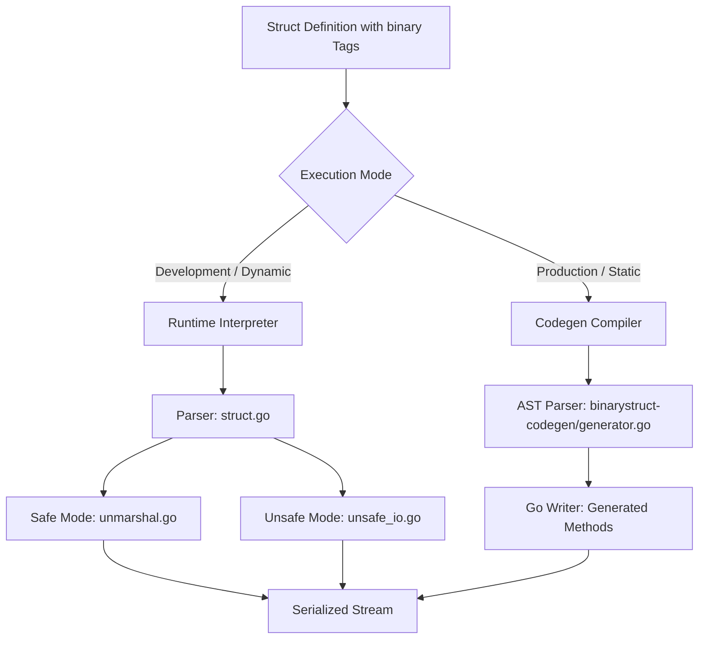

# Specification & Compiler Alignment Guide (Ground Truth)

This document serves as the ground-truth specification for the `binarystruct` tag syntax, runtime serialization semantics, and static code generation (codegen) compiler mapping. 

Any extension to the tag syntax, type options, or serialization logic **must** implement and align both the dynamic runtime path and the static code generator compiler path according to the rules defined below.

---

## 1. Ground Truth Specification & Semantics

| Binary Tag Type | Go Kind Representation | Serialized Width | Runtime Interpreter Logic | Codegen Compiler Mapping |
| :--- | :--- | :--- | :--- | :--- |
| **`int8`** / **`uint8`** / **`byte`** | `int8` / `uint8` / `bool` / `byte` | 1 byte | Reads/writes 1 byte. | `tmp[0] = byte(val)` / `val = tmp[0]` |
| **`int16`** / **`uint16`** / **`word`** | Signed/unsigned 16-bit | 2 bytes | Reads/writes 2 bytes; applies endianness. | `order.PutUint16(...)` / `order.Uint16(...)` |
| **`int32`** / **`uint32`** / **`dword`** | Signed/unsigned 32-bit | 4 bytes | Reads/writes 4 bytes; applies endianness. | `order.PutUint32(...)` / `order.Uint32(...)` |
| **`int64`** / **`uint64`** / **`qword`** | Signed/unsigned 64-bit | 8 bytes | Reads/writes 8 bytes; applies endianness. | `order.PutUint64(...)` / `order.Uint64(...)` |
| **`float32`** | `float32` | 4 bytes | IEEE 754 float32 mapping. | `math.Float32bits(...)` / `math.Float32frombits(...)` |
| **`float64`** | `float64` | 8 bytes | IEEE 754 float64 mapping. | `math.Float64bits(...)` / `math.Float64frombits(...)` |
| **`pad(size)`** | None | `size` bytes | Skips bytes on read; writes zero bytes on write. | `w.Write(make([]byte, size))` / `io.ReadFull(r, make([]byte, size))` |
| **`string(size)`** | `string` | `size` bytes | Raw string. Padded with `0` on write; trimmed on read. | `copy(writeBytes, stringBytes)` / `strlen := len(strBytes); for ; strlen > 0 && strBytes[strlen-1] == 0; strlen-- {}` |
| **`bstring`** / **`wstring`** / **`dwstring`** | `string` | 1/2/4 + len bytes | Length-prefixed string. Width of prefix defined by prefix type. | Writes/reads prefix width as integer, then writes/reads string bytes. |
| **`zstring`** | `string` | len + 1 bytes | Null-terminated C-style string. | Writes string + `0`; reads until `0` byte. |
| **`z16string`** | `string` | 2*len + 2 bytes | Null-word-terminated UTF-16 style string. | Writes string + `0x0000`; reads until `0x0000`. |
| **`ignore`** / **`-`** | Any | 0 bytes | Bypassed. | Bypassed. |
| **`any`** | Any | Natural | Resolves to Go field's natural primitive type mapping. | Bypassed or resolved to the primitive. |
| **`custom`** | Any | Custom | Requires `serializer` option. Delegates to custom Serializer. | Looks up serializer from Marshaller context via `GetSerializer()`; calls Serialize/Deserialize. |

### Tag Options

Tag options modify the behavior of binary types. They are appended after the type, e.g. `` `binary:"uint16,endian=big"` ``.

| Option | Syntax | Applies To | Description |
| :--- | :--- | :--- | :--- |
| **`endian`** | `endian=big\|little\|inverse` | Integer/float types | Overrides the struct-level byte order for this field. |
| **`encoding`** | `encoding=NAME` | String types | Applies a text encoding (e.g. Shift-JIS) registered in the Marshaller. |
| **`serializer`** | `serializer=NAME` | `custom` type | Specifies which registered Serializer to delegate to. |
| **`omittable`** | `omittable` or `omittable=Expr` | Any | Allows truncated streams: if EOF is reached at this field's start, decoding stops without error. |
| **`range`** | `range=min..max` | Numeric types | Validates deserialized value is within `[min, max]`. Returns error on violation. |
| **`match`** | `match=pattern` | String types | Validates deserialized string matches the regex pattern. Returns error on violation. |

---

## 2. Dynamic vs. Static Path Architecture

### Fast-Path Interface Dispatch

When a struct is passed to `Write`/`Read`, the runtime checks for these interfaces in priority order before falling back to reflection-based field iteration:

| Priority | Interface | Defined In | Purpose |
| :--- | :--- | :--- | :--- |
| 1 | `MarshallerContextWriter` / `MarshallerContextReader` | `marshal.go` / `unmarshal.go` | Generated code needing Marshaller access (text encodings, custom serializers). |
| 2 | `BinaryWriter` / `BinaryReader` | `marshal.go` / `unmarshal.go` | Generated code with no runtime dependencies. |
| 3 | `encoding.BinaryMarshaler` / `encoding.BinaryUnmarshaler` | Go stdlib | Standard library compatibility fallback. |

### Alignment Constraints
1. **Expression Evaluation**:
   * **Runtime**: Resolves expressions dynamically at execution time using `evaluateTagValue` which interprets terms referencing field values.
   * **Codegen**: Emits raw Go code with the variables prefixed by `s.` (e.g. `s.PayloadSz - 2`), delegating calculation to the Go runtime.
2. **End-of-Stream Omission (`omittable`)**:
   * **Runtime**: Catches `io.EOF` / `io.ErrUnexpectedEOF` at field start and silently terminates decoding.
   * **Codegen**: Generates a peek check on `r` (reading 1 byte, checking for EOF, and restoring via `io.MultiReader`) before reading the field.
3. **Regex Precompilation (`match=pattern`)**:
   * **Runtime**: Compiles regex once during `getStructMetadata()` via `regexp.Compile()` and stores it in the metadata cache.
   * **Codegen**: Declares a global package-level variable `var regex_Struct_Field = regexp.MustCompile(pattern)` to precompile at package load.

---

## 3. Extension Protocol (Sync Checklist)

When introducing a new binary type, tag option, or modifier, you **must** check off all of the following:

- [ ] **Step 1: Syntax Spec**
  Add the syntax definition to `STRUCT_TAGS.md` and `STRUCT_TAGS_ja.md`. Update Section 1 of this document (`SPECIFICATION.md`).

- [ ] **Step 2: Struct Analysis (`struct.go`)**
  Update `structFieldMetadata` to store parsed parameters. Update the tag-parsing logic in `parseTagString` to parse the new option/type.

- [ ] **Step 3: Safe-Mode Interpreter (`marshal.go` / `unmarshal.go`)**
  Update `readMain` / `writeMain` (and scalar/slice handlers) to implement the runtime behavior using standard reflection.

- [ ] **Step 4: Unsafe-Mode Interpreter (`unsafe_io.go`)**
  Update the pointer-offset loop in `unsafeWriteStruct` and `unsafeReadStruct` to optimize operations using direct memory access (unsafe pointer casting).

- [ ] **Step 5: Code Generator (`binarystruct-codegen/generator.go`)**
  Update `parseFieldTag` to extract the option/type. Update `generateFieldWrite` / `generateFieldRead` (and array handlers) to emit the compiled Go statements.

- [ ] **Step 6: Interface Verifications**
  If the option accesses dynamic instances (like text encodings or custom serializers), ensure it is wired through both the standard interface and context-aware interfaces (`MarshallerContextWriter` / `MarshallerContextReader`).

- [ ] **Step 7: Testing**
  Write unit tests verifying correct behavior in both safe and unsafe interpreter modes, and add a test structure verifying the same behavior in the static codegen integration suite ([codegen_integration_test.go](file:///home/jichoi/goproj/mixcode/binarystruct/codegen_integration_test.go)).
